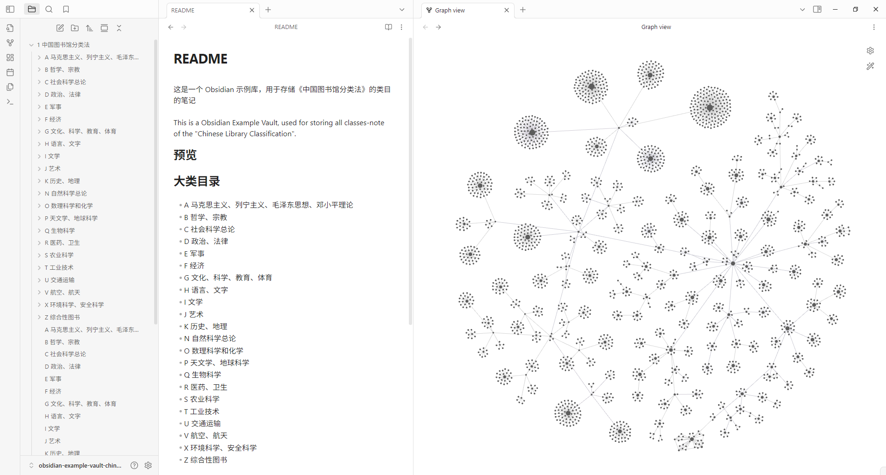

这是一个 Obsidian 示例库，用于存储《中国图书馆分类法》的类目的笔记

This is an Obsidian Example Vault for storing notes on the Classes of the "Chinese Library Classification".

## 预览

## 大类目录

- A 马克思主义、列宁主义、毛泽东思想、邓小平理论
- B 哲学、宗教
- C 社会科学总论
- D 政治、法律
- E 军事
- F 经济
- G 文化、科学、教育、体育
- H 语言、文字
- I 文学
- J 艺术
- K 历史、地理
- N 自然科学总论
- O 数理科学和化学
- P 天文学、地球科学
- Q 生物科学
- R 医药、卫生
- S 农业科学
- T 工业技术
- U 交通运输
- V 航空、航天
- X 环境科学、安全科学
- Z 综合性图书
