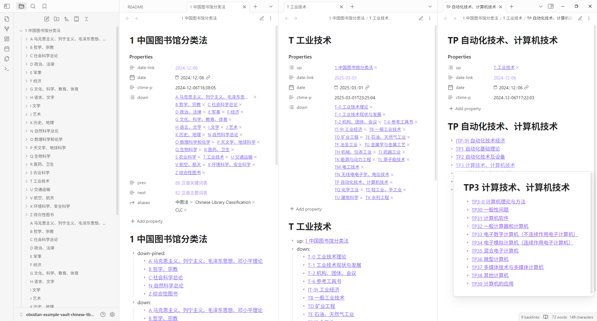
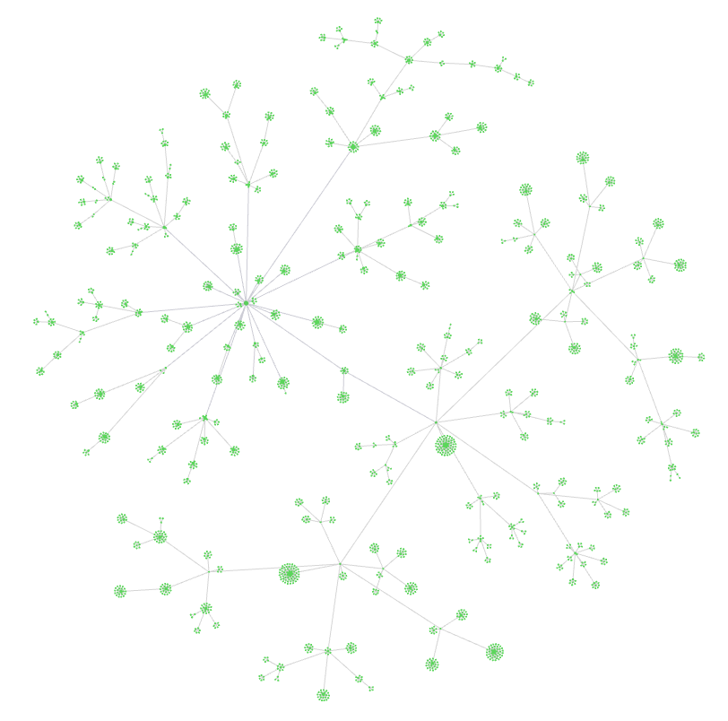

这是一个 Obsidian 示例库，用于存储《中国图书馆分类法》的类目的笔记

This is an Obsidian Example Vault for storing notes on the Classes of the "Chinese Library Classification".

## 预览图片

## 目录

- [A 马克思主义、列宁主义、毛泽东思想、邓小平理论](<data/中国图书馆分类法/A 马克思主义、列宁主义、毛泽东思想、邓小平理论.md>)
	- [Marxism, Leninism, Mao Zedong Thought and Deng Xiaoping Theory](<data/中国图书馆分类法/A 马克思主义、列宁主义、毛泽东思想、邓小平理论.md>)
- [B 哲学、宗教](<data/中国图书馆分类法/B 哲学、宗教.md>)
	- [Philosophy and religion](<data/中国图书馆分类法/B 哲学、宗教.md>)
- [C 社会科学总论](<data/中国图书馆分类法/C 社会科学总论.md>)
	- [Social science (General)](<data/中国图书馆分类法/C 社会科学总论.md>)
- [D 政治、法律](<data/中国图书馆分类法/D 政治、法律.md>)
	- [Politics,law](<data/中国图书馆分类法/D 政治、法律.md>)
- [E 军事](<data/中国图书馆分类法/E 军事.md>)
	- [Military affairs](<data/中国图书馆分类法/E 军事.md>)
- [F 经济](<data/中国图书馆分类法/F 经济.md>)
	- [Economy](<data/中国图书馆分类法/F 经济.md>)
- [G 文化、科学、教育、体育](<data/中国图书馆分类法/G 文化、科学、教育、体育.md>)
	- [Culture, science, education and sport](<data/中国图书馆分类法/G 文化、科学、教育、体育.md>)
- [H 语言、文字](<data/中国图书馆分类法/H 语言、文字.md>)
	- [Language,written language](<data/中国图书馆分类法/H 语言、文字.md>)
- [I 文学](<data/中国图书馆分类法/I 文学.md>)
	- [Literature](<data/中国图书馆分类法/I 文学.md>)
- [J 艺术](<data/中国图书馆分类法/J 艺术.md>)
	- [Art](<data/中国图书馆分类法/J 艺术.md>)
- [K 历史、地理](<data/中国图书馆分类法/K 历史、地理.md>)
	- [History, geography](<data/中国图书馆分类法/K 历史、地理.md>)
- [N 自然科学总论](<data/中国图书馆分类法/N 自然科学总论.md>)
	- [Natural science (General)](<data/中国图书馆分类法/N 自然科学总论.md>)
- [O 数理科学和化学](<data/中国图书馆分类法/O 数理科学和化学.md>)
	- [Mathematical science and chemistry](<data/中国图书馆分类法/O 数理科学和化学.md>)
- [P 天文学、地球科学](<data/中国图书馆分类法/P 天文学、地球科学.md>)
	- [Astronomy, earth science](<data/中国图书馆分类法/P 天文学、地球科学.md>)
- [Q 生物科学](<data/中国图书馆分类法/Q 生物科学.md>)
	- [Biology](<data/中国图书馆分类法/Q 生物科学.md>)
- [R 医药、卫生](<data/中国图书馆分类法/R 医药、卫生.md>)
	- [Medicine,health](<data/中国图书馆分类法/R 医药、卫生.md>)
- [S 农业科学](<data/中国图书馆分类法/S 农业科学.md>)
	- [Agriculture science](<data/中国图书馆分类法/S 农业科学.md>)
- [T 工业技术](<data/中国图书馆分类法/T 工业技术.md>)
	- [Technology](<data/中国图书馆分类法/T 工业技术.md>)
- [U 交通运输](<data/中国图书馆分类法/U 交通运输.md>)
	- [Transportation](<data/中国图书馆分类法/U 交通运输.md>)
- [V 航空、航天](<data/中国图书馆分类法/V 航空、航天.md>)
	- [Aviation,spaceflight](<data/中国图书馆分类法/V 航空、航天.md>)
- [X 环境科学、安全科学](<data/中国图书馆分类法/X 环境科学、安全科学.md>)
	- [Environmental science, safety science](<data/中国图书馆分类法/X 环境科学、安全科学.md>)
- [Z 综合性图书](<data/中国图书馆分类法/Z 综合性图书.md>)
	- [Comprehensive books](<data/中国图书馆分类法/Z 综合性图书.md>)

## 笔记库统计数据

|         |          |
| ------- | -------- |
| 类目笔记数量  | 2307 篇   |
| 类目笔记总行数 | 71532 行  |
| 类目笔记总字数 | 790060 字 |

## 数据的来源

- 《中国图书馆分类法》数据来源于Github 仓库 [acdzh/Chinese-Library-Classification: CLC, 中图法, 中国图书馆分类法](https://github.com/acdzh/Chinese-Library-Classification)
- 《中国图书馆分类法》附加的《ZT* 通用概念》和《ZY* 附表》数据来源于 [汉语主题词表服务系统](https://ct.istic.ac.cn/site/organize/index)
